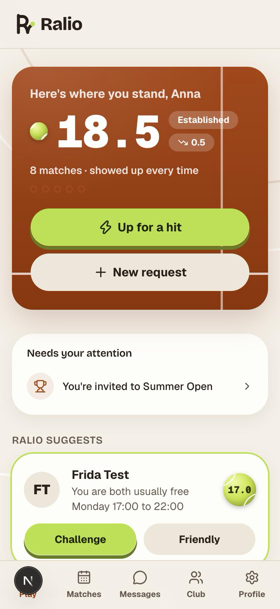
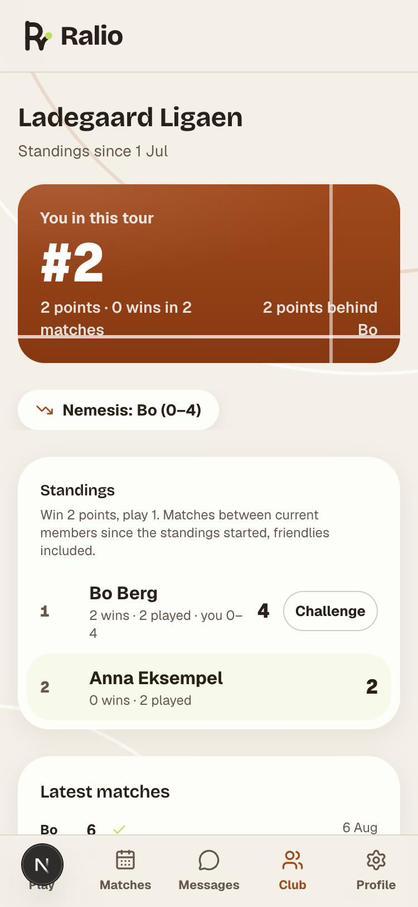
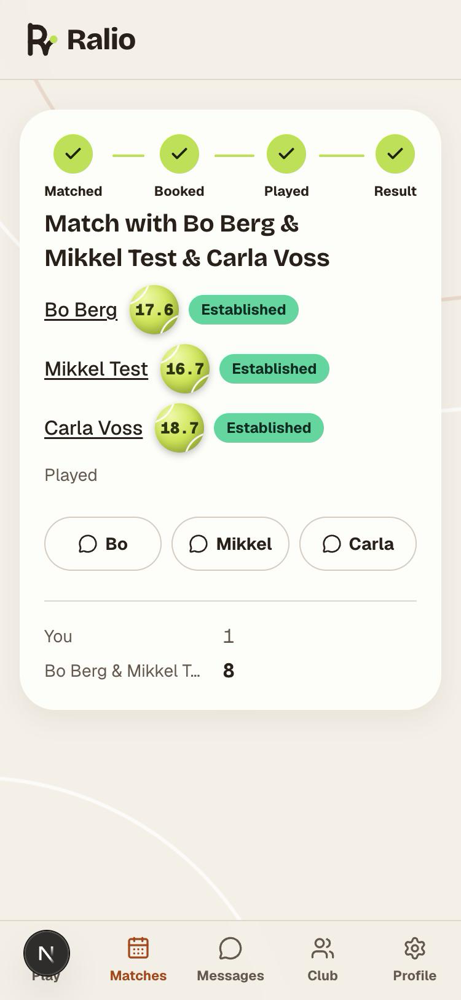
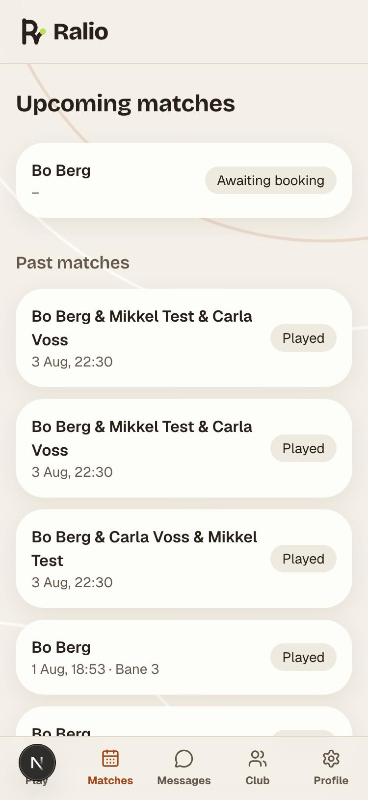

# Ralio

Hitting-partner matchmaking for tennis clubs. It ran in production for a pilot club from 2 August 2026, with a native iOS app on TestFlight from 11 August. The hosting has since been switched off, so the screenshots below come from a local run with test data.

This repository is the public walkthrough. The product code is private because it held real members' data and I would rather not publish the operational half (runbook, hosting, secrets handling). If you want to read the code, ask, and I will give you access. Three of the modules are excerpted here as they are in production, tests included.

&nbsp;
&nbsp;
&nbsp;

## The problem

Every tennis club has the same member: joined in spring, keen, plays at a level nobody in their circle plays at, and has nobody to hit with by June. Clubs answer with a WhatsApp group of 140 people and a noticeboard. Neither tells you who is free on Thursday at seven and is roughly your level.

Ralio answers that question. A member posts when they want to play, either as a standing request, an instant "Up for a hit" that lasts a couple of hours, or a booked court with an empty seat. The matching runs on level band and availability overlap, alerts go out by email, and the first player to accept gets the game. After the match, both players confirm the score and a WTN-shaped rating moves in capped steps. Friendlies are recorded but never move it.

On top of that sits the social layer, which runs on the same match pipeline: player profiles with head-to-head records, Tours (a friend group with a standings table where a win counts two and a played match one), tournaments in round robin and knockout form, and americano nights with rotating doubles scored per player.

## What it is

| | |
|---|---|
| Web | Next.js 16 (App Router), TypeScript, Tailwind and shadcn, next-intl (English and Danish) |
| Data | Postgres 17, Drizzle, 25 migrations, a DB outbox for every email and SMS |
| iOS | Expo 57 and Expo Router, sharing one zod contract package with the server, 47 `/api/v1` routes |
| Auth | Magic links with server-side sessions, 6-digit sign-in codes for the app, Google and Apple OIDC behind an env switch |
| Ops | One container on Hetzner via Coolify, Brevo for email, GatewayAPI for SMS. EU vendors only, by choice |
| Tests | 88 test files, unit and Postgres integration, plus four suites that pin structure rather than behaviour |
| Governance | GDPR pack in the repo: records of processing, risk assessment, breach procedure, two legitimate-interest assessments, a DPA register, and an erasure path that a test sweeps every column for |

Built in eleven working days between 31 July and 11 August 2026: 116 commits, 13 production deploys.

## What was hard

The interesting bugs were all about two people doing the same thing at the same moment. Doubles are first-to-accept, so two players can accept the last seat within the same second. A request can expire while an organiser is approving it. An open court can be claimed twice. Every transition in the request state machine locks its parent row `FOR UPDATE`, and the one transition without a parent, creating a request, serialises on an advisory lock instead. The integration suite runs those races on purpose.

The level scale is inverted, 40 is a beginner and 1 is elite, because that is how the World Tennis Number reads and players already know it. Every raw comparison outside `level.ts` was a bug waiting to happen, so the module owns all of them and has no imports at all, which also keeps the database driver out of the browser bundle. [`excerpts/level.ts`](excerpts/level.ts) is that module.

Score orientation had five implementations at one point, four of them mutually inconsistent, and two shipped bugs (standings and result emails). [`excerpts/scoreline.ts`](excerpts/scoreline.ts) is the module that ended it: one owner of "whose games come first" in a stored score.

Americano nights need every player to partner every other player exactly once over the evening. The circle method gives a perfect rotation for any even count. [`excerpts/americanoRotation.ts`](excerpts/americanoRotation.ts) is the pure generator with its property test.

The outbox gates on consent twice, once at enqueue and once in front of the transport, because a member can withdraw consent between the two and a regulated product cannot send that email. The same outbox dedupes, retries, and suppresses. It is the module I would show a compliance reviewer first.

Two lessons were paid for in production. Brevo drops mail sent from a subdomain silently after a 250 OK if the apex is the authenticated sender, with no bounce, and that was the launch bug that took longest to find. And Turbopack traces even lazy `import("@/db")` edges, so a module imported by a client component can never touch the database, not even dynamically. `npm run build` is now in every verification gate, because `vitest` and `tsc` do not catch client-bundle boundaries.

## Read further

- [`docs/architecture.md`](docs/architecture.md) is the map: the request pipeline, the modules that own each rule, and why the API routes contain no logic.
- [`excerpts/`](excerpts/) holds three production modules with their tests, copied verbatim and without a licence to reuse them.
- [`brand/`](brand/) has the logo set.
